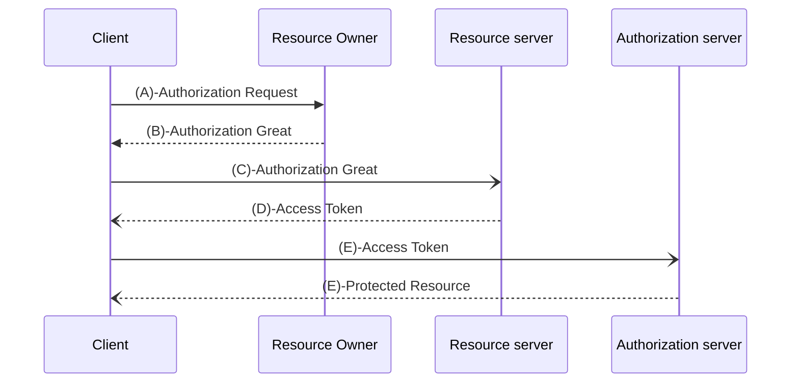

#### 令牌访问端点

##### Spring Security对OAuth2提供了默认可访问端点，即URL
- /oauth/authorize:申请授权码code，涉及类​​AuthorizationEndpoint​​
​​- /oauth/token:获取令牌token，涉及类​​TokenEndpoint​​
- /oauth/check_token:用于资源服务器请求端点来检查令牌是否有效，涉及类​​CheckTokenEndpoint​​
- /oauth/confirm_access:用于确认授权提交，涉及类​​WhitelabelApprovalEndpoint​​
​​- /oauth/error:授权错误信息，涉及​​WhitelabelErrorEndpoint​​
- /oauth/token_key:提供公有密匙的端点，使用JWT令牌时会使用，涉及类​​TokenKeyEndpoint​​


#### 获取请求授权码Code

涉及类​​org.springframework.security.oauth2.provider.endpoint.AuthorizationEndpoint​​
-   使用以下地址申请授权码
```
    http://localhost:8889/oauth/authorize​​​?client_id=test-pc&response_type=code
```
- 当请求到达授权中心​​AuthorizationEndpoint​​后，授权中心会要求资源所有者进行身份验证




